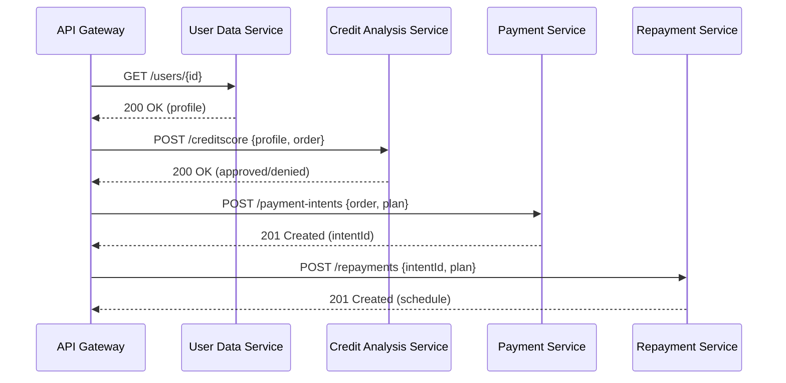

# Rocket Credit Gateway Service

The **Rocket Credit Gateway** is the public-facing entrypoint for the CreDIT platform. It exposes a single `/checkout` endpoint that orchestrates the complete purchase flow by delegating to the User Data, Credit Analysis, Payment, Repayment, and Notification microservices.

---

## Table of Contents

* [Architecture](#architecture)
* [Prerequisites](#prerequisites)
* [Local Setup](#local-setup)
* [Building](#building)
* [Running](#running)
* [Docker](#docker)
* [Configuration](#configuration)
* [API Reference](#api-reference)
* [Contributing](#contributing)

---

## Architecture



The gateway exposes only `/checkout`; downstream service calls are internal.

---

## Prerequisites

* Java 17 SDK
* Maven 3.6+
* Docker & Docker Compose (for containerized setup)
* Environment variables for each downstream URL (see [Configuration](#configuration))

---

## Local Setup

1. Clone the repository:

   ```bash
   git clone https://github.com/your-org/rocket-credit-gateway.git
   cd rocket-credit-gateway
   ```
2. Ensure environment variables are set (can also be passed as `-D` to Maven or CLI args).

---

## Building

Execute Maven package:

```bash
mvn clean package -DskipTests
```

The Spring Boot Maven plugin will repack the JAR into an executable `target/gateway-0.1.0-SNAPSHOT.jar`.

---

## Running

### Locally (without Docker)

```bash
java -jar target/gateway-0.1.0-SNAPSHOT.jar \
  --spring.profiles.active=dev \
  --USER_DATA_URL=http://localhost:8081 \
  --CREDIT_ANALYSIS_URL=http://localhost:8082 \
  --PAYMENT_URL=http://localhost:8083 \
  --REPAYMENT_URL=http://localhost:8084 \
  --NOTIFICATION_URL=http://localhost:8085
```

### Via Docker Compose

In the `rocket-credit-deployment/` folder, ensure `docker-compose.yml` includes the gateway service and correct URLs, then:

```bash
docker compose up -d --build gateway
```

---

## Docker

```dockerfile
FROM eclipse-temurin:17-jdk
WORKDIR /app
COPY target/gateway-*.jar app.jar
ENTRYPOINT ["java","-jar","app.jar"]
```

---

## Configuration

The gateway reads downstream service URLs from environment variables:

| Variable              | Default | Description                         |
| --------------------- | ------- | ----------------------------------- |
| `USER_DATA_URL`       | —       | Base URL of User Data service       |
| `CREDIT_ANALYSIS_URL` | —       | Base URL of Credit Analysis service |
| `PAYMENT_URL`         | —       | Base URL of Payment service         |
| `REPAYMENT_URL`       | —       | Base URL of Repayment service       |
| `NOTIFICATION_URL`    | —       | Base URL of Notification service    |

Spring profile can be set via `SPRING_PROFILES_ACTIVE` (e.g. `dev`, `prod`).

---

### Rate Limiting

Edge rate limiting is applied to `POST /checkout`:

- Per-IP limit: `RATE_LIMIT_PER_IP` requests per `RATE_LIMIT_WINDOW_SECONDS` (default 60 req/min).
- Per-partner limit: `RATE_LIMIT_PER_PARTNER` requests per `RATE_LIMIT_WINDOW_SECONDS` (default 300 req/min).

Environment variables (with defaults):

| Variable                       | Default | Description                              |
| ----------------------------- | ------- | ---------------------------------------- |
| `RATE_LIMIT_WINDOW_SECONDS`   | `60`    | Window size for counters                  |
| `RATE_LIMIT_PER_IP`           | `60`    | Max requests per IP per window            |
| `RATE_LIMIT_PER_PARTNER`      | `300`   | Max requests per partner per window       |

Backed by Redis for accuracy across instances. When a limit is exceeded, the gateway returns `429 Too Many Requests` with `Retry-After` header set to the remaining seconds in the current window.

---

## API Reference

### POST `/checkout`

* **Request Body**: `CheckoutRequest`

  ```json
  {
    "userId": 1,
    "cartTotal": 100.0
  }
  ```

* **Response (200)**: `CheckoutResponse`

  ```json
  {
    "paymentId": "...",
    "schedule": [
      { "dueDate": "2025-08-01", "amount": 50.0 },
      { "dueDate": "2025-09-01", "amount": 50.0 }
    ]
  }
  ```

For full schema, see `config/api/openapi-gateway.yaml`.

---

## Contributing

1. Fork the repo and create your branch: `git checkout -b feature/YourFeature`
2. Commit your changes: `git commit -m 'Add some feature'`
3. Push: `git push origin feature/YourFeature`
4. Open a Pull Request against `main`.

Please follow the existing code style and include unit tests for new functionality.
