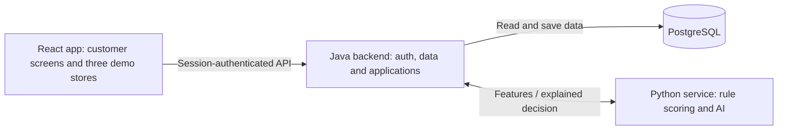

# Rocket Credit — Simple Diploma Architecture

Updated: 2026-09-16. Scope comes from [README](../README.md). Related documents: [completion plan](DIPLOMA_COMPLETION_PLAN.md) and [diploma topic](DIPLOMA_PROJECT_TOPIC.md).

This design replaces the earlier distributed-platform proposal. It is a target for the simplification work; the repository still contains the original microservices. This document update does not merge services, remove data or start applications.

## 1. Purpose

Build a small working demonstration of five topics:

1. Authentication: registration, password verification, sessions and access to the current user's data.
2. Multithreading: run independent data-preparation tasks sequentially and concurrently, then compare results and timings.
3. Scoring modules: combine understandable rules and explain the decision.
4. Safe data keeping: password hashes, ownership checks, database constraints, restricted access and recoverable storage.
5. AI analysis: train a small model on synthetic transaction/profile data and compare it with rules alone.

The product is a customer account, transaction history from three demo stores, a financing request and a saved decision. Completing a real or simulated payment is not required.

## 2. Architecture

One React application, one Java application backend, one small Python analysis service and one PostgreSQL database.



The backend owns persistence. Python receives a small JSON feature bundle and returns a result; it has no database, object store or callback into the backend. The separate Python process allows reuse of existing scoring code and Python ML libraries. It is the only internal service call in an application evaluation.

### Responsibilities

| Part | Responsibility | Existing code to reuse |
| --- | --- | --- |
| React app | Login, dashboard, history, request/result screens and three store pages | `demo-repository` |
| Java backend | Spring Security, users, history, catalog, feature preparation, application API and saving decisions | Built from the former `rocket-credit-user-data` foundation (legacy services removed after Step 7; see git history) |
| Python analysis | Rule modules, affordability, model inference and explainable result | `rocket-credit-analysis` pure scoring functions |
| PostgreSQL | Users, partner/product fixtures, transactions and applications | Adapt useful User Data schema and seed concepts |
| Offline research scripts | Generate synthetic data, train/evaluate model and benchmark threads | Small new `research/` directory |

Proposed Java packages: `auth`, `users`, `partners`, `transactions`, `applications`, and `analysis`. These are modules inside one application, not independent services.

## 3. Main user flow

1. The customer registers or logs in.
2. The dashboard shows their seeded transactions across the three partners.
3. They choose a partner and amount directly, or follow “Apply with Rocket Credit” from a demo store page.
4. The backend derives the user ID from the session and validates the partner, amount and optional product.
5. The backend collects profile, partner-history and synthetic financial features.
6. Python runs the rule modules and, when enabled for that request, the trained model.
7. The backend saves the request, input snapshot and complete result in one database transaction before returning success.
8. The customer sees the decision and can revisit it in application history.

Outcomes are `APPROVED`, `REJECTED` and `REVIEW`. In this prototype, `REVIEW` means “insufficient evidence for an automatic decision”; an operator dashboard and review-resolution process are outside scope. A possible lower amount can be displayed as a suggestion for a new request, without offers, acceptance or payment state.

An application does not become a purchase transaction. Store transactions are seeded historical data, displayed separately from credit application history.

### Demo partners

Use routes such as `/stores/streambox`, `/stores/markethub` and `/stores/threadly` in the same React app. Each has its own branding, a small catalog and a financing button. No partner backend, merchant account, API credentials, webhook or partner portal is required.

Pass a partner slug/product ID through the link and resolve its price on the backend. A direct application accepts the customer's requested amount with validation; a product-based application uses the stored product price. Query-string prices are not authoritative. The flow is a demonstration of store navigation, not a commercial integration.

## 4. Authentication research

Use Spring Security with email/password login and a server-side session.

- Store password hashes using a framework password encoder such as BCrypt, never plaintext or reversible password encryption.
- On login, let Spring Security verify the hash and create/rotate the session identifier. On logout, invalidate the session.
- Keep session state in the single Java process; restarting it requires login again. No Redis or identity-provider deployment is needed.
- Use an HttpOnly session cookie, an appropriate SameSite setting and Secure cookies when served over HTTPS. Keep CSRF protection for state-changing requests.
- Serve frontend/API from one origin in the built demo; use Vite's API proxy during development.
- Apply user ownership checks to transaction and application queries. The browser cannot select a different user by changing an ID.

Research evidence: trace registration → login → authenticated request → logout, inspect cookie behavior, and demonstrate that one account cannot read another account's records.

## 5. Multithreading research

Use one bounded Java executor for the application, with a small configurable pool and queue. Do not create a thread pool per request.

After authentication and validation, compare these two modes:

```text
Sequential: profile features -> history features -> finance features -> scoring

Parallel:   profile features --+
            history features --+-> join results -> scoring
            finance features --+
```

Each task owns its inputs/output. If reading through JPA in a worker, use a separate short read transaction and materialize DTOs there; do not share a persistence context or lazy entities between threads. Do not write shared mutable score maps. Pass the assembled feature bundle to Python only after all required tasks complete.

Add a total timeout and handle task failure clearly. A failed required task produces a technical error, not a credit rejection. Sequential and parallel modes must produce identical features/decisions.

Measure both normal execution and a clearly labeled experiment with controlled simulated I/O delays. Small local computations may show no gain or become slower with threads; report that result. Record repeated-run median/p95 latency, pool size, dataset size and errors. A short benchmark script and CSV output are enough; distributed tracing and load infrastructure are unnecessary.

## 6. Scoring and AI research

Keep scoring modules in the existing Python project:

| Module | Inputs | Output |
| --- | --- | --- |
| Profile rules | Seeded account age and profile completeness | Score and reasons |
| Partner-history rules | Order counts, refunds, purchase amounts and on-time indicators | Score and reasons |
| Affordability | Synthetic income, expenses, obligations and partner cap | Possible amount and amount-limit check |
| AI model | Selected normalized profile/history/financial features | Estimated synthetic risk, model version and contributions |
| Decision combiner | Rule scores, optional AI result and affordability | Status, score, possible amount and reason codes |

Begin with rules alone, then add logistic regression trained offline on synthetic customers. Store the model as a local artifact loaded at startup. Load only trusted project-generated artifacts; the API does not accept uploaded models.

A simple experimental policy is sufficient:

```text
rulesScore = 0.60 * historyScore + 0.40 * profileScore
aiScore = 1 - predictedSyntheticRisk
finalScore = 0.80 * rulesScore + 0.20 * aiScore    when AI is enabled and available
finalScore = rulesScore                         otherwise

disposableIncome = max(0, income - expenses - obligations)
possibleAmount = min(partnerCap, disposableIncome * demoMultiplier)
```

Scores are normalized to 0–1. The multiplier, weights and thresholds are illustrative experiment settings, stored in a versioned configuration file. The affordability cap is independent of the requested amount and the model score, making it easy to explain and test. Use decimal money and USD only.

Reject invalid inputs before scoring. Missing required evidence gives `REVIEW`; known zero capacity or a request above the cap gives `REJECTED`. Otherwise compare final score with configured approval/review thresholds. An approved request must be within the cap. Optional AI opt-out or inference failure uses rules alone and is recorded explicitly. If the entire Python service is unavailable, return a retryable technical error.

The form includes “Use AI analysis for this request.” Store that choice and the displayed explanation version with the decision. No external account collection, scraping or consent-management service is required. The AI analyzes existing synthetic app data.

Evaluate rules versus rules-plus-AI on the same held-out synthetic customers. Record a confusion matrix, precision/recall and ROC-AUC where meaningful. Do not generate labels simply by copying the exact rule decision being evaluated; describe the generator and the limitations of synthetic labels. Training is separate from serving.

## 7. Safe data keeping

Use one database with a small schema:

| Table | Key fields |
| --- | --- |
| `users` | ID, unique email, password hash, display name, created time |
| `demo_financial_profiles` | User ID, synthetic income, expenses, obligations and completeness indicators |
| `partners` | ID, slug, display name, demo amount cap |
| `products` | ID, partner ID, name, price and currency |
| `transactions` | ID, user ID, partner ID, external fixture ID, amount, date and status |
| `credit_applications` | ID, user ID, partner/product reference, requested amount, decision, possible amount, score, reasons, factor results, feature snapshot, AI choice/status, policy/model versions and creation time |

Small snapshots fit in PostgreSQL JSONB; MinIO and a separate audit service are unnecessary. Only the Java backend connects to PostgreSQL. Python receives derived features without names, emails, password hashes or session cookies.

Demonstrate password hashing, parameterized database access, ownership checks, foreign keys, amount constraints, restricted database credentials, secrets outside Git, redacted logs and a local backup/restore. Password hashing is not database encryption: document reliance on host/disk protection for local data at rest, and use HTTPS for a hosted demonstration. Do not claim production security certification.

Store all request/result fields atomically. Do not return a successful saved decision if the database write fails. This local transaction is sufficient because scoring has no external business side effects.

## 8. Simplification of the existing repository

| Existing/proposed infrastructure | Decision |
| --- | --- |
| Gateway and User Data as separate services | Consolidate required behavior into proposed `rocket-credit-backend`, based on User Data's Java/Spring foundation. |
| Python analysis with its own DB and MinIO calls | Keep the rule functions; change it to accept features and return results without persistence. |
| Payment and Repayment services/schedulers | Exclude from the diploma runtime; retain old code as reference until simplification is verified. |
| Redis and claim-check library/MinIO | Remove from the new runtime; use in-process sessions and PostgreSQL snapshots. |
| Four service databases / additional workflow DB | Use one new diploma database; do not overwrite old databases. |
| Keycloak, partner backend, footprint service | Do not add them. |
| Kafka, outbox, webhook delivery, saga recovery | Outside the simplified scope. |
| Dedicated bank connector / scraper | Replace with synthetic fixtures; no external integration. |
| Operator and merchant portals | Outside scope. |
| Multiple branded frontend deployments | Three store pages in the existing React app. |

Add a clearly named diploma Compose file containing `backend`, `analysis` and `db`. The built React app can be served by Java; Vite is a separate process only during frontend development. Keep the original Compose setup as a labeled legacy reference until the simplified path works.

The migration plan must preserve existing source changes and database volumes. Copy only useful source/configuration into the new backend, never compiled artifacts or old database passwords.

## 9. Completion boundary

The project is complete when a customer can log in, inspect partner history, request credit directly or from any store page, receive and revisit an explained decision, and the repository contains measured demonstrations of the five research topics. Additional commerce workflows are optional future work.
