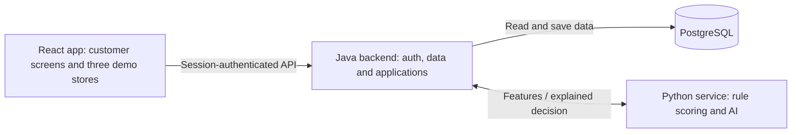

# Diploma Project Topic

Updated: 2026-09-16. This revision follows the research priorities in [README](../README.md) and replaces the earlier microservice-commerce scope.

Detailed design: [architecture](DIPLOMA_ARCHITECTURE.md). Implementation tasks: [completion plan](DIPLOMA_COMPLETION_PLAN.md).

## Title

A Credit Decision Web Application: Authentication, Multithreading, Modular Scoring, Secure Data Storage and AI Analysis

## Short description

The diploma develops a small web application in which a customer has an account and synthetic transaction history from several demo stores. The customer selects a store and requests an amount of credit. The application analyzes stored profile, purchase-history and synthetic financial data, then returns an explained decision and a possible amount.

The project is a practical setting for researching five software topics: authentication, multithreading, modular scoring, safe data keeping and AI analysis. Its contribution is the implementation and evaluation of these mechanisms in a working application.

## Main objective

Build and explain a simple full-stack credit decision prototype, showing how user accounts are protected, independent tasks run concurrently, scoring modules work together, data is stored safely, and a trained model contributes to analysis.

## Research questions

1. How do password hashing, server-side sessions and ownership checks protect account data?
2. How does a bounded thread pool affect independent feature preparation compared with sequential execution, and what correctness risks must be controlled?
3. How can separate rule modules produce an understandable credit decision and amount limit?
4. Which storage and access controls are sufficient to demonstrate responsible handling of a prototype's user data?
5. How does a simple trained model compare with rules alone on a fixed synthetic dataset, and how can its contribution be explained?

## Demonstration scenario

1. A customer registers and logs in.
2. They inspect their transaction history across StreamBox, MarketHub and Threadly.
3. They choose a partner and requested amount, or navigate from a demo store's product page.
4. They choose whether to use AI analysis for this request.
5. The backend prepares features and sends them to the scoring service.
6. The application displays approval, rejection or an inconclusive review result with reasons and a possible amount.
7. The customer can revisit saved applications and log out.

Transactions represent seeded historical purchases. A credit application is a separate record and does not transfer money or create a new purchase.

## Scope

Required:

- Customer registration, login, logout and session handling.
- Per-user history from three fictional demo partners.
- A credit request form and persisted, explained results.
- Demo partner frontend pages linking to that form.
- Independent profile/history rules and affordability calculation.
- A small trained AI model operating on synthetic structured data.
- Sequential and multithreaded feature preparation with a measured comparison.
- Focused tests and documented data protection controls.

Outside the required scope:

- Real banks, payment providers, credit issuance or automatic repayment collection.
- Separate partner backends, merchant authentication and webhooks.
- External identity-provider deployment, social login or enterprise roles.
- Queues, distributed transactions, outbox delivery, workflow engines or high-availability infrastructure.
- Web scraping, social-network accounts and real digital-footprint collection.
- Operator/merchant portals, offer acceptance and negotiation.
- Production compliance certification or claims of real credit-risk accuracy.

A `REVIEW` result demonstrates uncertainty in automatic decisions. Resolving it through a human-review workflow is future work. A lower possible amount is informational; the customer may submit a new request.

## Simple architecture



Customer and store pages are part of one React application. The Java backend owns all persistent data. The Python service is stateless and reads a trusted local model artifact plus versioned policy configuration. It does not connect to PostgreSQL or collect data from other services.

This keeps the existing Java/Python technologies useful while reducing deployment to one backend, one analysis service and one database. The built React application can be served by Java; Vite is used during development.

## Research topic 1 — Authentication

Implement authentication using Spring Security, a framework password encoder such as BCrypt, and server-side sessions.

Study registration, hashing and verification, session creation/rotation, cookie attributes, CSRF protection, authenticated requests and logout. Use the session's user identity to authorize access to history and applications.

Demonstrate two accounts: each can access its own data and cannot retrieve the other's records. Session state can remain in the single backend process; persistence across backend restarts is unnecessary for this demonstration.

Expected evidence: authentication-flow explanation and tests for invalid credentials, missing session, logout, CSRF and cross-user access.

## Research topic 2 — Multithreading

Compare sequential and concurrent preparation of three independent feature groups: profile, partner history and synthetic finances.

Use a shared bounded Java executor. Workers have isolated data access or immutable inputs and return separate results. Join those results before scoring. Explain thread safety, database transaction boundaries, queue limits and timeout handling.

Measure ordinary local execution and a separate controlled experiment with simulated I/O delays. Keep features and decisions identical in both modes. Present timing results even if thread overhead means no improvement on small local datasets.

Expected evidence: implementation comparison, correctness tests and a repeated-run median/p95 timing table with experiment conditions.

## Research topic 3 — Modular scoring

Separate scoring into profile rules, partner-history rules, affordability, optional AI inference and a final combiner.

Each rule module returns a score and reason codes. Affordability computes an illustrative cap from synthetic disposable income and the partner's limit. The combiner applies versioned weights and thresholds.

Example experimental policy:

```text
rulesScore = 0.60 * historyScore + 0.40 * profileScore
aiScore = 1 - predictedSyntheticRisk
finalScore = 0.80 * rulesScore + 0.20 * aiScore  if enabled and available
finalScore = rulesScore                       otherwise

disposableIncome = max(0, income - expenses - obligations)
possibleAmount = min(partnerCap, disposableIncome * demoMultiplier)
```

Validate positive requested amounts and use decimal money in USD. Missing required evidence produces review. Known zero capacity or an amount above the cap produces rejection. Other cases use the configured score thresholds; approval always requires the amount to be within the cap.

Weights and the multiplier are illustrative research settings, not banking recommendations. Persist the policy version and factor results so examples can be explained.

Expected evidence: module-level tests, score contributions, amount boundaries and understandable decision examples.

## Research topic 4 — Safe data keeping

Store users, partner/product fixtures, synthetic financial profiles, transactions and credit applications in one PostgreSQL database.

Demonstrate:

- Password hashing and omission of credential fields from responses.
- User ownership checks on private queries.
- Parameterized access, foreign keys and numeric constraints.
- Database credentials and service secrets outside source control.
- Redacted logs and restricted database/service access.
- Atomic storage of the request, feature snapshot and result.
- A local backup and restore procedure.

Send only derived features to Python, excluding names, email addresses, password hashes and sessions. Store small decision snapshots directly in PostgreSQL JSONB.

Explain the difference between password hashing, database access controls and encryption at rest. The local demonstration relies on documented host/disk protection; use HTTPS for a hosted demo. The project demonstrates selected controls without claiming production certification.

Expected evidence: access tests, schema explanation, saved decision example and backup/restore demonstration.

## Research topic 5 — AI analysis

Train a logistic-regression model on synthetic customer data using selected profile, transaction-history and financial features. The model predicts a defined synthetic risk label, not a proven probability of real credit default.

Document data generation and label assumptions. Split by customer before training, fit preprocessing on training data only and exclude identifiers, future outcomes and label-revealing fields. Avoid defining the evaluation target as an exact copy of the baseline rules.

Train offline and load the versioned artifact into the existing Python scoring service. Record whether inference was used for each request. When the customer disables AI or only the model is unavailable, use rules alone and record the fallback. A failure of the entire service is a technical error, not a credit rejection.

Compare rules and rules-plus-AI on the same held-out customers. Report a confusion matrix, precision/recall and ROC-AUC where meaningful, along with examples of model contributions and limitations. Improvement is an experimental question, not an assumed outcome.

Expected evidence: repeatable training/evaluation scripts, model version, metric table and explained examples.

## Technology choices

| Area | Choice |
| --- | --- |
| Frontend | Existing React, TypeScript, Vite and Tailwind application |
| Main backend | Java and Spring Boot, based on the existing User Data foundation |
| Authentication | Spring Security, password hashes and in-process sessions |
| Concurrent work | Bounded Java executor |
| Scoring and ML | Existing Python/FastAPI project with scikit-learn |
| Persistence | One PostgreSQL database with migrations |
| Local setup | Small Docker Compose configuration |
| Research artifacts | Scripts, JSON/CSV results and simple plots |

Exact dependency versions are selected and tested during implementation. Existing Payment, Repayment, Redis and MinIO components are not required by this revised design.

## Methodology and completion order

1. Consolidate the backend and simplify Python into a stateless service.
2. Implement sessions, accounts and user isolation.
3. Add synthetic partner history, financial fixtures and storage controls.
4. Implement rules and save explained decisions.
5. Connect customer screens and three store pages.
6. Train, integrate and evaluate the AI model.
7. Implement and measure the sequential/parallel experiment.
8. Verify the complete demonstration and write the research findings.

Detailed steps and completion checks are in [DIPLOMA_COMPLETION_PLAN.md](DIPLOMA_COMPLETION_PLAN.md).

## Expected result and limitations

The result is a small, reproducible web application and research report covering all five topics from README. An examiner can log in, inspect history, apply directly or from a store page, and inspect the saved explanation.

The financial data and labels are synthetic. The system makes no payment and performs no real identity verification. Model metrics describe this dataset only. Scaling, production operations and real financial integrations remain future work.

## Suggested diploma chapters

1. Introduction, objectives and research questions.
2. Application requirements and simplified architecture.
3. Authentication and authorization.
4. Data model and safe storage.
5. Rule modules and explainable decisions.
6. AI model, dataset and evaluation.
7. Multithreading implementation and measurements.
8. Demonstration, tests, limitations and conclusions.
